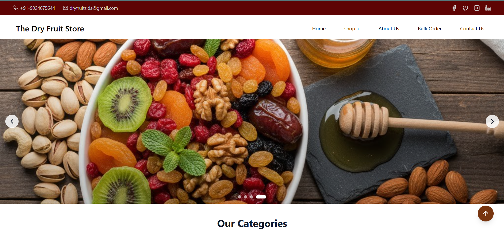
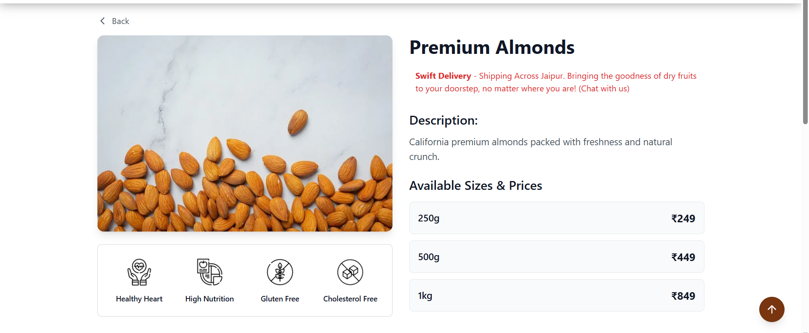
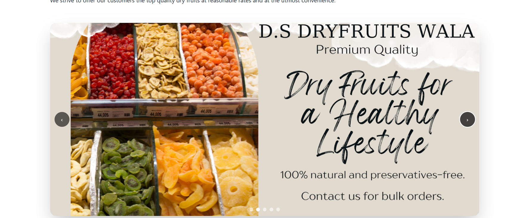
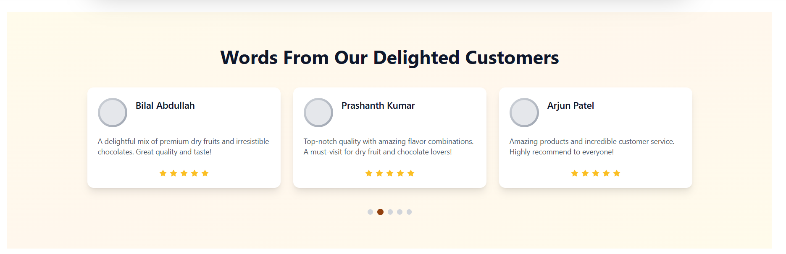
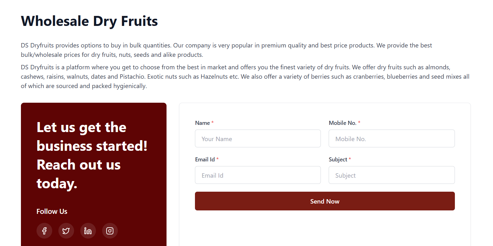
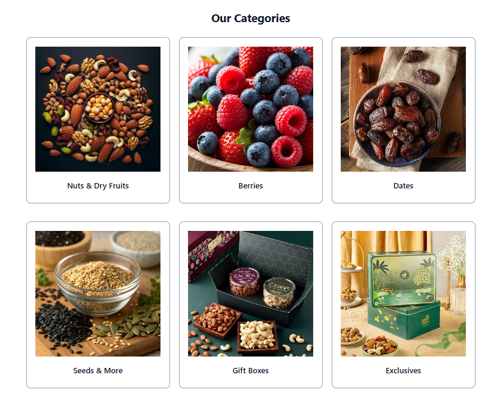

#  Premium Dry Fruit & Gift Box Store

A modern, full-stack MERN e-commerce application designed for selling premium dry fruits, nuts, and themed gift boxes.

This Site was built to provide a seamless shopping experience where customers can browse products by specific "Themes" (like Nuts, Berries, or Exotic Mixes) and select custom weight variants for each item.



## 💡 The Idea

The core concept behind this site is Theme-Based Shopping. Instead of a generic product list, the store is organized into curated collections:

- **Themed Navigation**: Users browse by categories (e.g., "Premium Nuts", "Berry Blast").
- **Flexible Variants**: Every product supports multiple weight options (e.g., 250g, 500g, 1kg) with dynamic pricing.
- **Visual Storytelling**: A focus on high-quality imagery and clean UI to showcase the premium nature of the products.

## 🚀 Key Features

- **Dynamic Theme System**: Products are linked to themes in the database, allowing for easy categorization and expansion.
- **Product Variants**: Robust data model supporting multiple weight/price combinations for a single product.
- **Featured Collections**: A specialized section on the homepage to highlight top-selling items.
- **Responsive Design**: Fully responsive UI built with Tailwind CSS and shadcn/ui components.
- **Fast Performance**: Frontend powered by Vite for lightning-fast reloading and building.
- **Scalable Backend**: RESTful API built with Node.js and Express, connected to MongoDB Atlas.

## 🛠️ Tech Stack

### Frontend

- **React 18** (via Vite)
- **Tailwind CSS** - Utility-first styling
- **shadcn/ui** - Reusable, accessible UI components
- **React Router DOM** - Client-side routing
- **Axios** - API integration
- **Lucide React** - Modern icons

### Backend

- **Node.js & Express.js** - Server-side logic
- **MongoDB & Mongoose** - Database and Object Data Modeling
- **CORS** - Security and resource sharing
- **Dotenv** - Environment variable management

## 📁 Project Structure

```
DS/
├── backend/                # Node.js API
│   ├── models/             # Mongoose Schemas (Product, Theme)
│   ├── routes/             # Express Routes (GET/POST endpoints)
│   └── server.js           # Entry point
│
└── client/                 # React Client
    ├── src/
    │   ├── component/      # UI Components (ThemeCard, ProductCard, etc.)
    │   ├── data/           # Static data (Carousel images)
    │   ├── page/           # Views (HomePage, ThemePage, ProductPage)
    │   ├── utils/          # API connectors (axios setup)
    │   └── App.jsx         # Main Router
    └── ...
```

## 📦 Installation & Setup

Follow these steps to run the project locally.

### 1. Prerequisites

- Node.js (v16+)
- MongoDB Atlas Account (or local MongoDB)

### 2. Backend Setup

```bash
cd backend
npm install
```

Create a `.env` file in the `backend` folder:

```env
MONGO_URI=your_mongodb_connection_string
PORT=5001
```

Start the server:

```bash
node server.js
```

Server runs on: `http://localhost:5001`

### 3. Frontend Setup

Open a new terminal and navigate to the client:

```bash
cd client
npm install
npm run dev
```

## 📸 Screenshots

<table>
  <tr>
    <td></td>
    <td></td>
    <td></td>
  </tr>
  <tr>
    <td></td>
    <td></td>
    <td></td>
  </tr>
</table>

## 🤝 Contributing

This is a personal project, but suggestions are welcome!

1. Fork the repo
2. Create a feature branch (`git checkout -b feature/AmazingFeature`)
3. Commit your changes (`git commit -m 'Add some AmazingFeature'`)
4. Push to the branch (`git push origin feature/AmazingFeature`)
5. Open a Pull Request

## 📄 License

Distributed under the ISC License.
